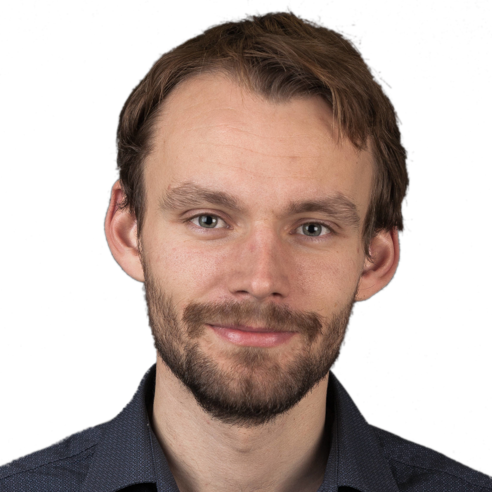
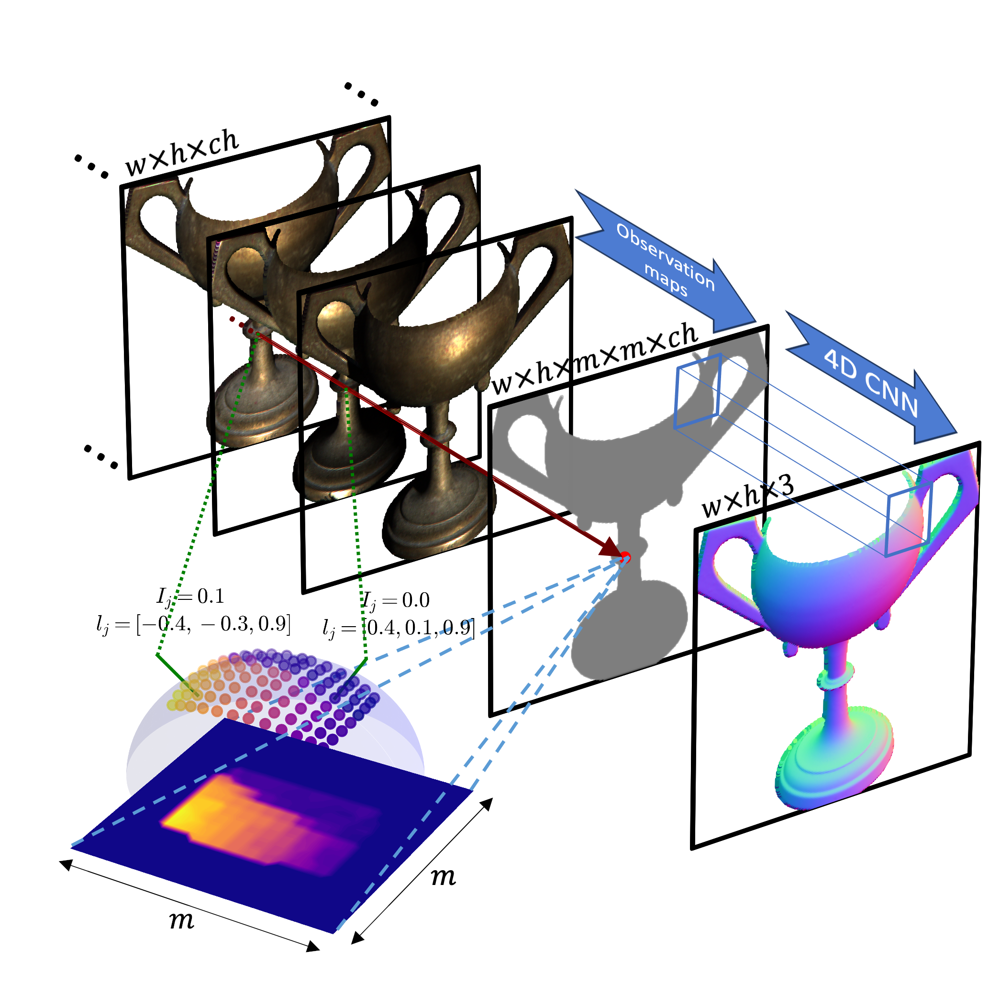
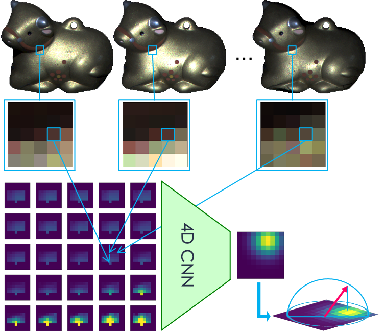
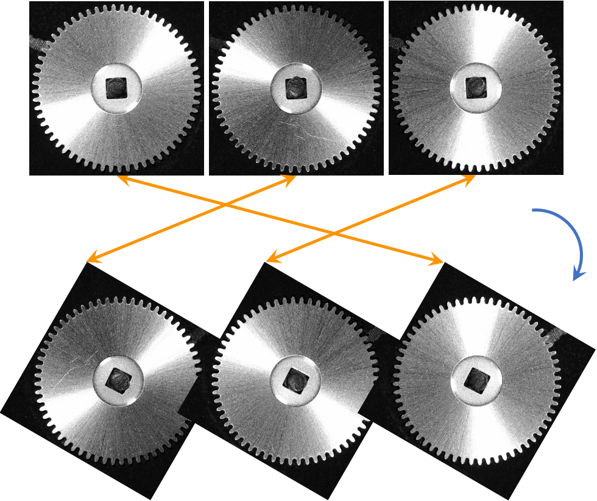
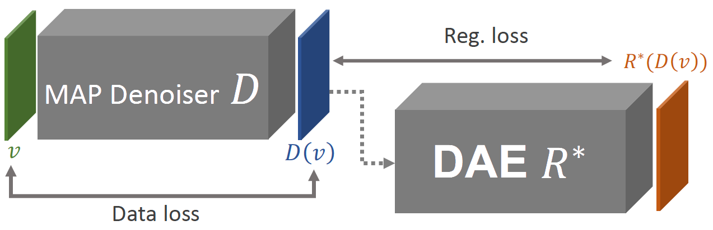
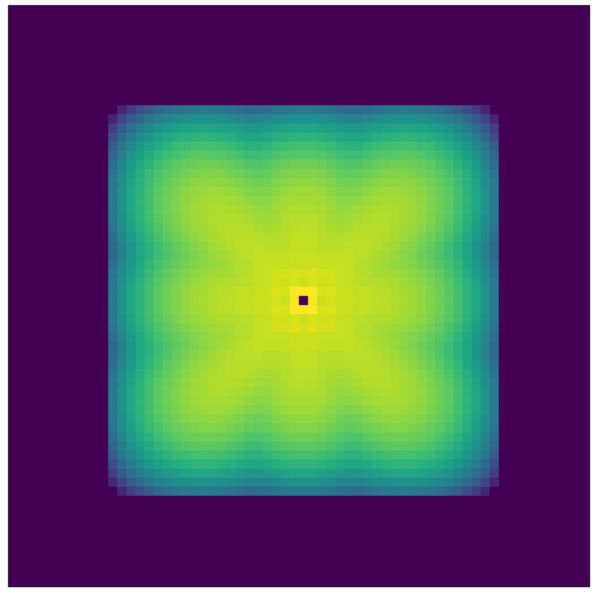
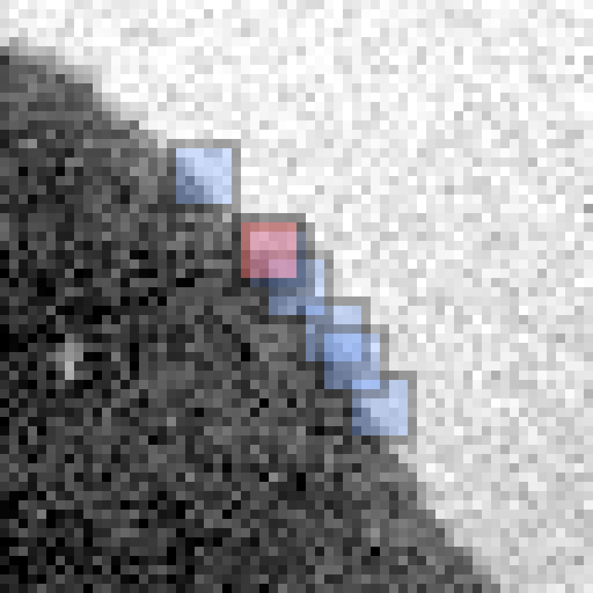
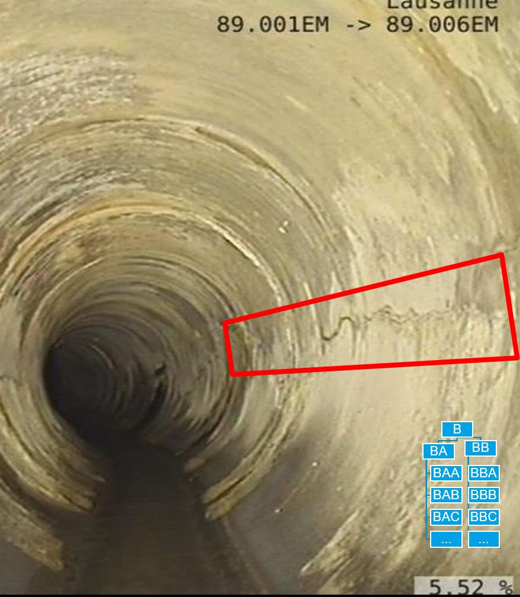
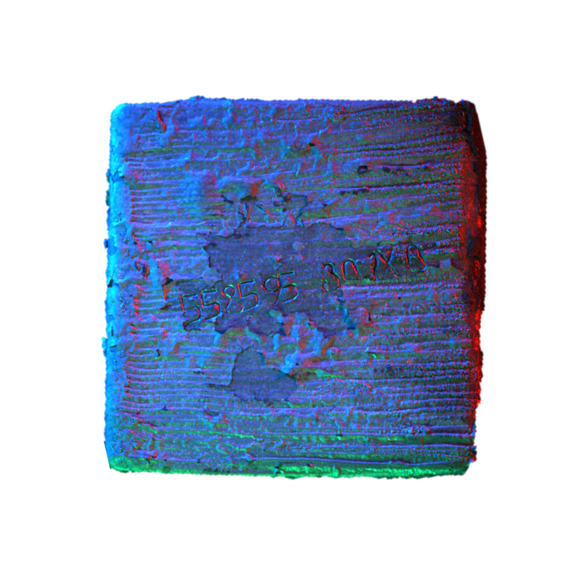
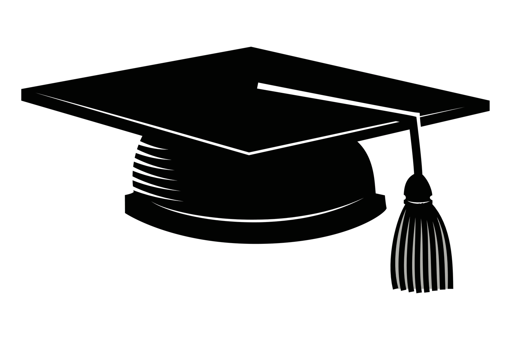

    

    

        
 I am David, a PhD graduate from <a href="https://www.epfl.ch/labs/cvlab/">CVLab</a>, <a href="https://www.epfl.ch/en/">EPFL</a> and Edge AI and Vision Group at <a href="https://www.csem.ch/">CSEM</a>. I was working under supervision of <a href="https://people.epfl.ch/pascal.fua/bio">Prof. Pascal Fua</a> and Dr. Engin Türetken in the team of <a href="https://people.epfl.ch/andrea.dunbar/bio">Andrea Dunbar</a>.
        My work in computer vision revolved around light-matter interactions with a particular focus on defect detection and photometric stereo. My other research interests include image restoration and anomaly detection.

        

        Before starting my PhD at CSEM & EPFL, I studied at <a href="https://www.mff.cuni.cz/.en">Charles University, Faculty of Mathematics and Physics</a> (Prague, Czechia), where I obtained my MSc and BSc degrees in computer science. In 2015 I spent half a year at <a href="https://fri.uni-lj.si/en">University of Ljubjana</a> (Ljubljana, Slovenia) as an exchange student.

    

<h2 class="spanswhole">Publications</h2>

  

  

        <h3>A Spatio-Photometric Neural Architecture for Photometric Stereo with Rendering in the Training Loop</h3>
        

        
<b>David Honzátko</b>, Engin Türetken, L Andrea Dunbar, Pascal Fua

        
<i>Submitted to ECCV 2024</i>

        
Topics: Photometric Stereo

        
Technologies: PyTorch, Mitsuba 3, Docker, Python, C++

        
For the best performance, photometric stereo methods should account for global illumination effects, diverse materials, and a potentially unknown number of light sources. While some techniques thoroughly exploit the photometric information at individual pixels to estimate the corresponding surface normals, others give more weight to the spatial context of the neighboring pixels.

        
In this work, we introduce a convolutional architecture that does both by exploiting reflectance-related information encoded in observation maps within spatial neighborhoods. We train our network on samples rendered on-the-fly using a new path-tracing technique on a large dataset of objects covering diverse materials, object sizes, and illumination scenarios. We show that our approach outperforms the state-of-the-art techniques, including transformer-based ones, on all standard reference benchmarks featuring real images. Our source code and pre-trained models will be released to promote future research.

  

    

    

        <h3>Leveraging Spatial and Photometric Context for Calibrated Non-Lambertian Photometric Stereo</h3>
        
<a href="https://arxiv.org/abs/2103.12106">[Paper]</a> <a href="https://github.com/DawyD/UNet-PS-4D">[Code]</a>

        
<b>David Honzátko</b>, Engin Türetken, Pascal Fua, L Andrea Dunbar

        
<i>3DV 2021</i>

        
Topics: Photometric Stereo

        
Technologies: TensorFlow 2, Keras, Python

        
The problem of estimating a surface shape from its observed reflectance properties still remains a challenging task in computer vision. The presence of global illumination effects such as inter-reflections or cast shadows makes the task particularly difficult for non-convex real-world surfaces. State-of-the-art methods for calibrated photometric stereo address these issues using convolutional neural networks (CNNs) that primarily aim to capture either the spatial context among adjacent pixels or the photometric one formed by illuminating a sample from adjacent directions.

        
In this paper, we bridge these two objectives and introduce an efficient fully-convolutional architecture that can leverage both spatial and photometric context simultaneously. In contrast to existing approaches that rely on standard 2D CNNs and regress directly to surface normals, we argue that using separable 4D convolutions and regressing to 2D Gaussian heat-maps severely reduces the size of the network and makes inference more efficient. Our experimental results on a real-world photometric stereo benchmark show that the proposed approach outperforms the existing methods both in efficiency and accuracy.

    

    

    

        <h3>Defect Segmentation for Multi-Illumination Quality Control Systems</h3>
        
<a href="https://link.springer.com/article/10.1007/s00138-021-01244-z">[Paper]</a> <a href="https://github.com/DawyD/illumination-preserving-rotations">[Code]</a> <a href="https://doi.org/10.5281/zenodo.5513768">[Dataset]</a>

        
<b>David Honzátko</b>, Engin Türetken, Siavash A Bigdeli, L Andrea Dunbar, Pascal Fua

        
<i>Machine Vision and Applications 2021</i>

        
Topics: Defect Detection Photometric Stereo

        
Technologies: TensorFlow 2, Keras, Python

        
Thanks to recent advancements in image processing and deep learning techniques, visual surface inspection in production lines has become an automated process as long as all the defects are visible in a single or a few images. However, it is often necessary to inspect parts under many different illumination conditions to capture all the defects. Training deep networks to perform this task requires large quantities of annotated data, which are rarely available and cumbersome to obtain. To alleviate this problem, we devised an original augmentation approach that, given a small image collection, generates rotated versions of the images while preserving illumination effects, something that random rotations cannot do. We introduce three real multi-illumination datasets, on which we demonstrate the effectiveness of our illumination preserving rotation approach. Training deep neural architectures with our approach delivers a performance increase of up to 51% in terms of AuPRC score over using standard rotations to perform data augmentation. 

    

    

    

        <h3>Image Restoration using Plug-and-Play CNN MAP Denoisers</h3>
        
<a href="https://arxiv.org/abs/1912.09299">[Paper]</a> <a href="https://github.com/DawyD/cnn-map-denoiser">[Code]</a>

        
Siavash A. Bigdeli, <b>David Honzátko</b>, Sabine Süsstrunk, L. Andrea Dunbar

        
<i>VISAPP 2020</i>

        
Topics: Image Restoration

        
Technologies: TensorFlow 1, Python

        
Plug-and-play denoisers can be used to perform generic image restoration tasks independent of the degradation type. These methods build on the fact that the Maximum a Posteriori (MAP) optimization can be solved using smaller sub-problems, including a MAP denoising optimization. We present the first end-to-end approach to MAP estimation for image denoising using deep neural networks. We show that our method is guaranteed to minimize the MAP denoising objective, which is then used in an optimization algorithm for generic image restoration. We provide theoretical analysis of our approach and show the quantitative performance of our method in several experiments. Our experimental results show that the proposed method can achieve 70x faster performance compared to the state-of-the-art, while maintaining the theoretical perspective of MAP.

    

    

    

        <h3>Efficient Blind-Spot Neural Network Architecture for Image Denoising</h3>
        
<a href="https://arxiv.org/abs/2008.11010">[Paper]</a> <a href="https://github.com/DawyD/Blind-spot-CNNs">[Code]</a> <a href="https://www.youtube.com/watch?v=A2964CbHwNI">[Video]</a>

        
<b>David Honzátko</b>, Siavash A. Bigdeli, Engin Türetken, L. Andrea Dunbar

        
<i>Swiss Conference on Data Science (SDS) 2020</i>

        
Topics: Image Restoration

        
Technologies: TensorFlow 2, Keras, Python

        
Image denoising is an essential tool in computational photography. Standard denoising techniques, which use deep neural networks at their core, require pairs of clean and noisy images for its training. If we do not possess the clean samples, we can use blind-spot neural network architectures, which estimate the pixel value based on the neighbouring pixels only. These networks thus allow training on noisy images directly, as they by-design avoid trivial solutions. Nowadays, the blind-spot is mostly achieved using shifted convolutions or serialization. We propose a novel fully convolutional network architecture that uses dilations to achieve the blind-spot property. Our network improves the performance over the prior work and achieves state-of-the-art results on established datasets.

    

    

    

        <h3>Accelerating Block-Matching and 3D Filtering Method for Image Denoising on GPUs</h3>
        
<a href="https://link.springer.com/article/10.1007/s11554-017-0737-9">[Paper]</a> <a href="https://github.com/DawyD/bm3d-gpu">[Code]</a> 

        
<b>David Honzátko</b>, Martin Kruliš

        
<i>Journal of Real-Time Image Processing 2017</i>

        
Topics: Image Restoration

        
Technologies: CUDA, C++

        
Denoising photographs and video recordings is an important task in the domain of image processing. In this paper, we focus on block-matching and 3D filtering (BM3D) algorithm, which uses self-similarity of image blocks to improve the noise-filtering process. Even though this method has achieved quite impressive results in the terms of denoising quality, it is not being widely used. One of the reasons is a fact that the method is extremely computationally demanding. In this paper, we present a CUDA-accelerated implementation which increased the image processing speed significantly and brings the BM3D method much closer to real applications. The GPU implementation of the BM3D algorithm is not as straightforward as the implementation of simpler image processing methods, and we believe that some parts (especially the block-matching) can be utilized separately or provide guidelines for similar algorithms.

    

<h2 class="spanswhole">Disclosed Industrial Projects</h2>

    

    

        <h3>Detecting Defects in Sewers</h3>
        
CSEM & Ville de Lausanne

        
<i>Presented at <a href="https://udam.home.blog/euro-sam/">EURO-SAM 2023</a></i>

        
Topics: Defect Detection

        
Inspection of sewers is currently conducted by manually controlled robots, whose operators identify defects in the camera stream they see. Such inspection is however expensive, lengthy, and subjective. To remove some of these issues, we have conducted a feasibility study on whether it is possible to develop and train AI algorithms on existing data to automatically detect the defects in the camera stream and hence alleviate the subjectivity of annotations. The preliminary results have shown that our algorithms can indeed help.

    

    

    

        <h3>VIVALDI: steel billet tracking with advanced computer vision</h3>
        
CSEM & SMS-Concast

        
<a href="https://www.csem.ch/en/news/swiss-steel-plant-manufacturer-sms-concast-partners/">[Press Release]</a> <a href="https://doi.org/10.1117/12.3001270">[Conference Presentation]</a> 

        
Sébastien Blanc, Pedram Pad, Engin Turetken, Nicolas Cantale, <b>David Honzátko</b>, Andrea L Dunbar, Stephan Feldhaus, Gian Hauenstein, Marcel Meier, Tomaso Mendler, Giovanni Michelon, Clément Kündig, Thomas Meier

        
<i>Presented at <a href="https://spie.org/conferences-and-exhibitions/photonics-west">Photonics West 2024</a></i>

        
Topics: Photometric Stereo

        
Our advanced computer vision system allows for the precise tracking of serial numbers on steel billets in challenging industrial settings. It combines cutting-edge hardware and machine learning, excelling in character recognition (99.8%) and localization while adapting to dynamic ambient lighting conditions. Moreover, it accurately measures crucial geometric parameters such as side sizes, bulging, and skewness. This multifaceted technology promises to elevate material tracking, quality assessment, and production optimization in the steel industry to unprecedented levels.

    

<h2 class="spanswhole">Theses</h2>

    

    

        <h3>PhD Thesis: Aggregating Spatial and Photometric Context for Photometric Stereo</h3>
        
<a href="https://infoscience.epfl.ch/record/307334?v=pdf">[Thesis]</a>

        
Topics: Photometric Stereo

        
Institution: EPFL & CSEM

        
Supervisors: <a href="https://people.epfl.ch/pascal.fua/bio">Prof. Pascal Fua</a>, Dr. Engin Türetken

        
Examiners: <a href="http://imagine.enpc.fr/~aubrym/">Dr. Mathieu Aubry</a>, <a href="http://cvl.ist.osaka-u.ac.jp/en/member/matsushita/">Prof. Yasuyuki Matsushita</a>, <a href="https://people.epfl.ch/sabine.susstrunk/bio">Prof. Sabine Süsstrunk</a>

        
President: Dr. Martin Rajman

    

    

    

        <h3>Master's Thesis: Generative neural networks in image reconstruction</h3>
        
<a href="https://dodo.is.cuni.cz/handle/20.500.11956/94721">[Thesis]</a>

        
Topics: Image Restoration

        
Institution: Charles University & Czech Academy of Sciences

        
Supervisor: <a href="https://www.utia.cas.cz/cs/people/sorel">Dr. Michal Šorel</a>

        
Opponent: Dr. Peter Zvirinský

    

    

    

        <h3>Bachelor's Thesis: GPU Acceleration of Advanced Image Denoising</h3>
        
<a href="https://dodo.is.cuni.cz/handle/20.500.11956/82511">[Thesis]</a>

        
Topics: Image Restoration

        
Institution: Charles University

        
Supervisor: <a href="https://d3s.mff.cuni.cz/people/martinkrulis/">Prof. Martin Kruliš</a>

        
Opponent: Dr. Oskár Elek

    

